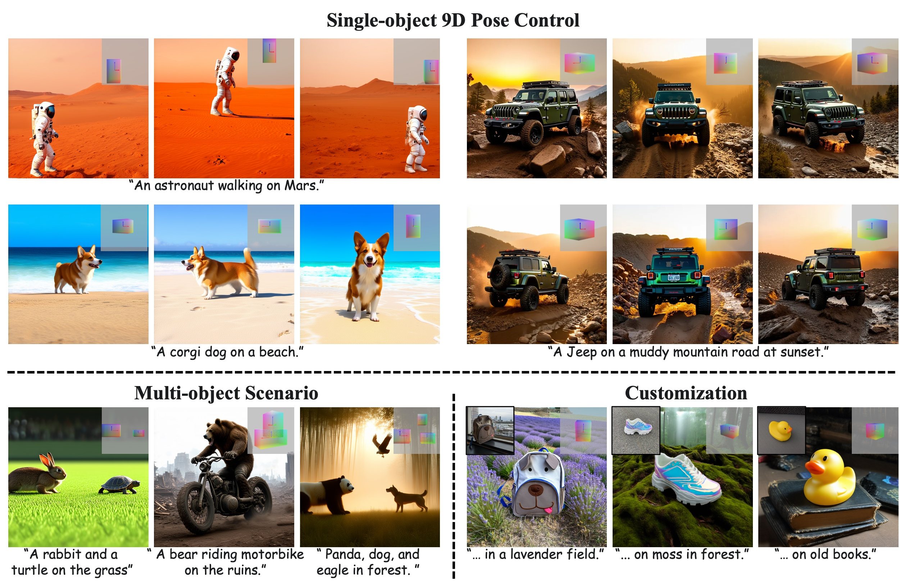

<p align="center">
  <h2 align="center">SceneDesigner: Controllable Multi-Object Image Generation with 9-DoF Pose Manipulation</h2>
<p align="center">
    <a href="https://github.com/qqzy/"><strong>Zhenyuan Qin<sup>*</sup></strong></a>
    ·
    <a href="https://github.com/xinchengshuai/"><strong>Xincheng Shuai<sup>*</sup></strong></a>
    ·
    <a href="https://henghuiding.com/"><strong>Henghui Ding </strong><sup>†</sup></a>
</p>

<p align="center">
    Fudan University
</p>
<p align="center">
<a href="https://arxiv.org/abs/"></a>
<a href="https://henghuiding.com/SceneDesigner/"></a>
</p>


<!-- ## 🎯 Introduction -->





## ✒️ Citation

If you find our work useful for your research and applications, please kindly cite using this BibTeX:

```bibtex
@inproceedings{SceneDesigner,
        title={SceneDesigner: Controllable Multi-Object Image Generation with 9-DoF Pose Manipulation},
        author={Qin, Zhenyuan and Shuai, Xincheng and Ding, Henghui},
        booktitle={NeurIPS},
        year={2025}
      }
```
